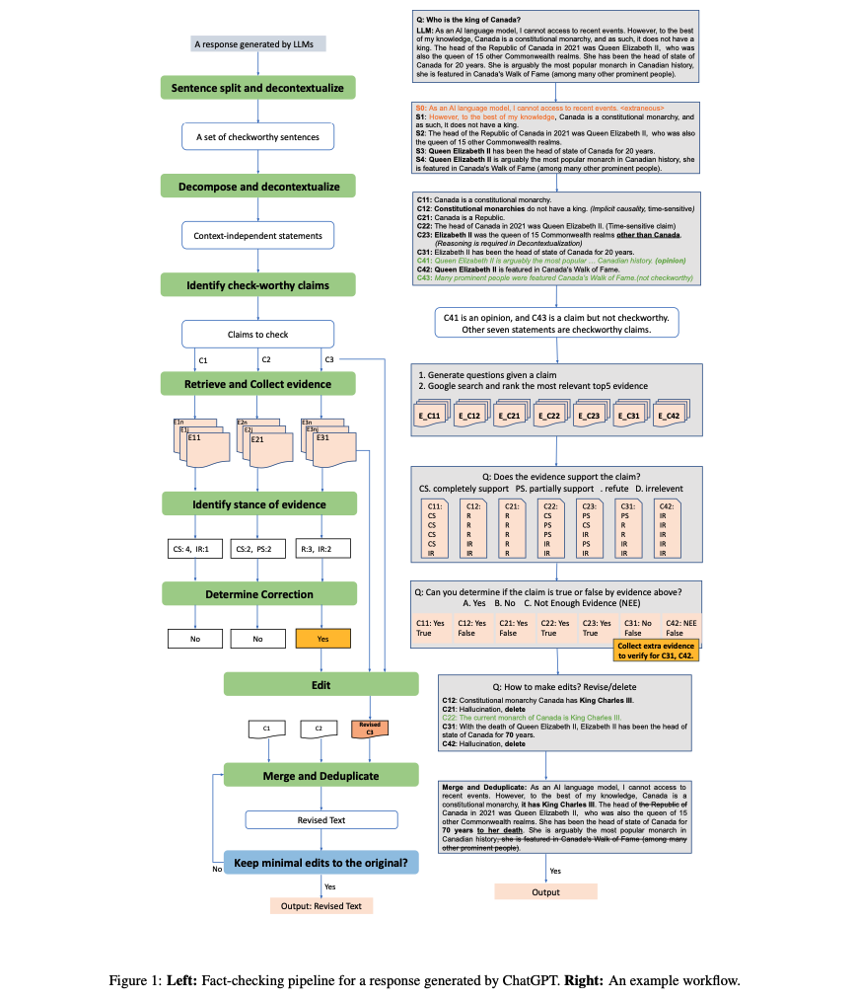
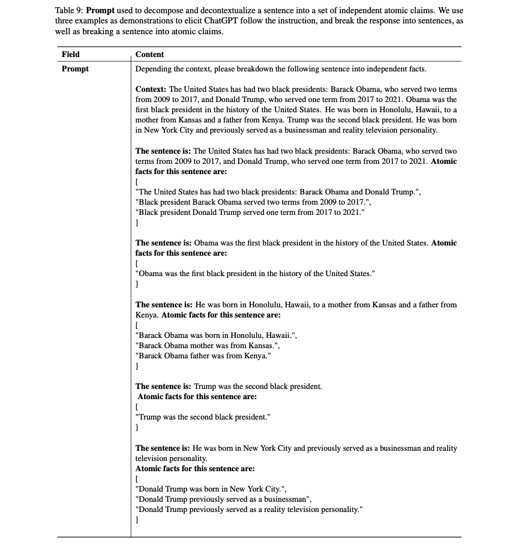
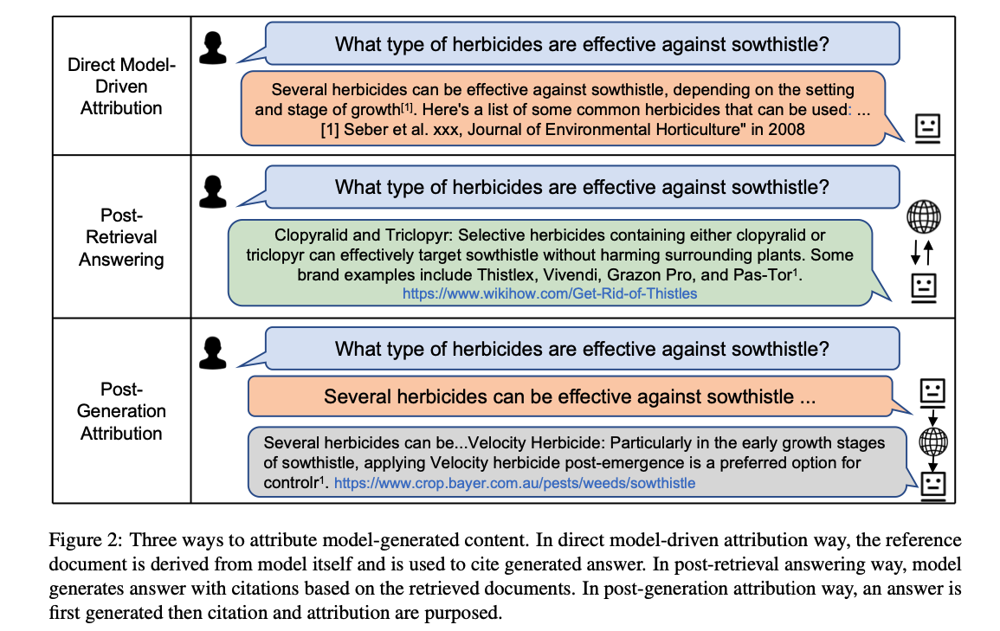

# To run 
1. prepare checkpoint
```
mkdir checkpoint
wget -O checkpoint/model_base_retrieval_coco.pth https://storage.googleapis.com/sfr-vision-language-research/BLIP/models/model_base_retrieval_coco.pth
```
2. run
```
python src/run.py
```


=====

[Automated Fact-Checking Resources](https://github.com/Cartus/Automated-Fact-Checking-Resources#out-of-context-classification)


# Survey
[A Survey on Automated Fact-Checking](https://watermark.silverchair.com/tacl_a_00454.pdf?token=AQECAHi208BE49Ooan9kkhW_Ercy7Dm3ZL_9Cf3qfKAc485ysgAAA0kwggNFBgkqhkiG9w0BBwagggM2MIIDMgIBADCCAysGCSqGSIb3DQEHATAeBglghkgBZQMEAS4wEQQMJfBy0sOW6B3VLjPXAgEQgIIC_Oe7RfN3uxQDzckzSZaHK3_RIeIxdaasWgpzjmyEFdV_DoFYs3hNqwf36PsiqNfzxemApAsNTx3aCnwEA7OmrA5gv0hIdxxJnOIiZu4dK8Rep4564YcyVmgT-ujCNItAqfThWtR2NgF2v5noPBy_5ccPGQNLftqNCCC6Vd6yhfnqrmp_18owI82oMJgfkoPOwX2Lra9pTa4B316aVM7XLeCNx2w4Lo5JjLKoslBeE3GFScjJSXyfZZmtJ__k9mGWwEDBoZbqhty3r08jIfa7Qm1rTU7awKdfanlHlOKwkfea3vrQsqM6H8w6n-0Ni74eF5l5vpVbqNXuMoXMLPDlOETIVSIvA3PzK1GTOuvpcF3oDZw6-4Ip0hQmVWsHVaEKZId9MNWlny_xWuxyr_P32WPvzvwdzIqFv90h5bIq8dUerarQKuIqJ_selJUhtCoTQ6ZKso2t06RdQH3lnz2kUlDe0u4F_KTf23ImvW1mrCwruQ_CRM9zITgEmbomxIStdXl2_sKMlGRVWNB5RuxD483cD12t9upQ4kaoObBMdKEQwlR6ddUxdLE5gw3HKN3Gx53BoHUWYP6fRtkhVgHW1vji-AlZYv5x2PY9umG1mNqZdMmYShkdx0P-hyQNyW9URaw0DYPOvHeotARAnO76kRF7eKItAN1gNbDYaYZEq_Zpl3bETGk9SKoyVWOn-oZQb_eJg4Tu1hEE-1W6iXhQgTGspYsLT8XfTld4oO8Nn7hcOMZu68004a1GKf6T_QvOKbiV4iLWrJ4FvADRIvs96ICddFYdmsnf6wm4Nt3mVkdp2N31r7G7zChgWgkKyeOJvUAZbvifBoomvUAnMhFJFHJQrMjRgs0dqXkiCngz1AqmtB9u3aub80r6ciGOTD_bGsMB-U1A29WGjx1zUNI-YWSvRw7pnp8jJNx1XHLXB6Eyv1XxG3T0S9mh5cAFoUKdU6cOt45-7drYRxb7ekK1rkotTbHhZsR-OD1GMjHC-9TBjFn3nxUakmM_wowU)

three stages:
1. claim detection : identify claims that require veri- fication -> classification task
2. evidence retrieval : find sources supporting or refuting the claim
3. claim verification : assess the veracity of the claim based on the retrieved evidence -> entailment task
    - verdict : claims are assigned truthfulness labels
    - justification production : explanations for verdicts must be produced

# Factcheck-GPT
[Factcheck-GPT: End-to-End Fine-Grained Document-Level Fact-Checking and Correction of LLM Output](https://arxiv.org/abs/2311.09000)
[github.com/yuxiaw/Factcheck-GPT](https://github.com/yuxiaw/Factcheck-GPT)

提出一个端到端自动标注框架，输出 verifiability 和 factual inconsistencies 。

FELM (Chen et al., 2023)  ：84 world-knowledge responses w/ sentence-level true or false labels



将「automated detection and correction」拆分为7个子任务：
1) decomposition; 句子拆分：将整篇文行拆分为 context-independent 的 statement 集合，也就是相互不依赖，可以单独进行事实性检验。
    - 使用 in-context learning ChatGPT API + NLTK API
    
2) de-contextualisation; 上下文隔离：将 statement 进一步转化为 claim，要求 independent，atomic ，checkable 。
3) checkworthiness identification; 可信度判别：
    - 转化为分类任务：factual claim，opinion，not a claim，others。
    - 同时对 claim 的重要性也进行分类：most important，intermediate，less important.
4) evidence retrieval and collection; 事实检索：
    - 用 ChatGPT 得到 query，使用 Google 进行检索，Sentence-BERT 重排取 top-5 。
5) stance detection; 立场检测：检测当前 claim 对 fact 的立场。
    - 同样转化为分类任务：support，partially support，refute，irrelevant
    <!-- - 用 FactScore (Min et al., 2023) 进行打分 -->
6) correction determination; 判断纠正：给定一系列 labeled fact，决定如何对 claim 进行更新，包含选择哪些fact，是否需要额外的检索。
7) claim correction; 主张更正：更新原始的 claim，更新方式包含：delete the whole claim, replace X to Y, delete X 。

还提出了一个自动标注工具，包含4个步骤：
1. 分解：Decomposition, Decontextualization and Check-worthiness detection.
2. 检索：an automatic evidence retrieval system（Bing search）
3. 判断：Evidence stance identification and Claim correction.
4. 汇总：Claim Merge and Deduplication.


# 大模型幻觉溯源

[A Survey of Large Language Models Attribution](https://arxiv.org/abs/2311.03731)


溯源(Attribution)
1. 溯源指一个实体(如文本模型)生成和提供证据(通的能力。
2. 溯源通过提供参考来源增强了可解释性和可信度，对验证大模型生成内容的真实性和可靠性至关重要
3. 溯源生成的陈述是否完全基于引用的来源，决定了溯源是否准确


溯源的主要方法
1. 模型直接溯源: 由大模型自己提供答案的溯源但是这种方法通常面临的挑战是答案和溯源本身也可能是幻觉。
2. 检索后回答:这种方法进行显式的检索信息，然后让模型基于检索的数据进行回答，但是检索不等同于溯源，当模型内部知识和外部检索信息之间的界限变得模糊时，可能会导致潜在的知识冲突。
3. 生成后溯源: 系统首先提供一个答案，然后使用问题和答案进行搜索以进行溯源，post-editing。

溯源评价指标
1. human
2. 基于分类 ：1) 可归因 - 参考完全支持生成的语句；2) 推断性归因 - 参考对语句提供的支持不足；以及3) 矛盾性归因 - 语句直接与引用引述的内容相矛盾。
3. 量化指标 ：
    - [ Towards verifiable generation](http://arxiv.org/abs/2310.05634)
        1) 正确性 - 评估生成文本与提供的来源的一致性；
        2) 精确性 - 测量生成的归因与当前问题相关的百分比；
        3) 召回率 - 评估生成的归因捕捉关键知识的范围。
    - [QUIP-Score ](https://arxiv.org/abs/2305.13252)：评估一节文本在多大程度上由文本语料库中的 span 组成。

溯源的错误类型
1. 粒度错误 Granularity Error.: 对于模糊的问题，检索的多文档可能包含复杂和多样的信息。因此，答案是复杂的和混合的，导致引文不足
2. 错误综合 Mistaken synthesis.: 模型在提供多个复杂文档时，可能会混淆实体和事件之间的关系。引文应该忠实地引用生成的文本，并引用所有参考文献。
3. 幻觉生成 Hallucinated Generation.: 参考文档可能与问题不相关或无关或者模型在外部文档和参数知识之间存在冲突。答案将是幻觉，引文是不准确的。

溯源的局限性
1. 一个主要挑战是识别何时以及如何溯源: 区分般知识和需要溯源的专业知识是一个微妙的任务，这种灰色地带会导致溯源的不一致。
2. 另一个问题是溯源的潜在不准确性: 答案可能会与无关或错误的来源相关联，这种错误溯源会使用户感到困惑，影响所呈现信息的可靠性。
3. 另外，知识的流动性意味着一些信息保持静态，而其他数据随时间推移而发展和变化。因此，LLM的一些溯源可能会很快过时。

# QACHECK
[QACHECK: A Demonstration System for Question-Guided Multi-Hop Fact-Checking](https://arxiv.org/abs/2310.07609)

# ClaimNorm
[https://arxiv.org/abs/2310.14338](https://arxiv.org/abs/2310.14338)