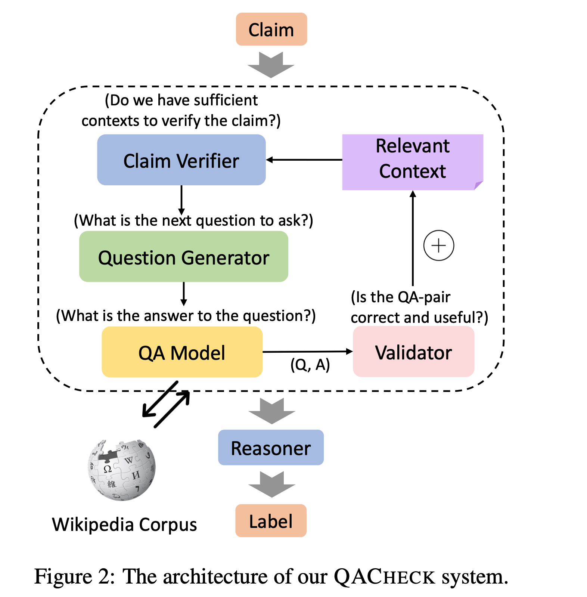
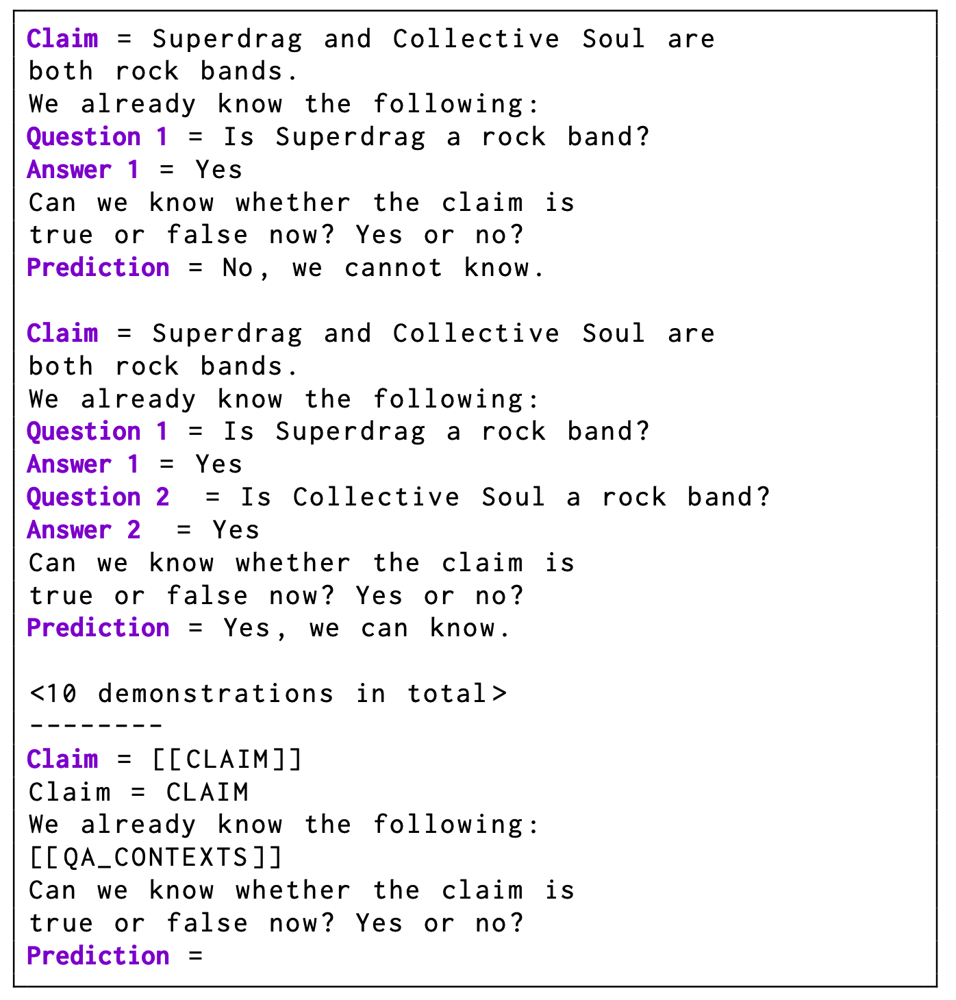
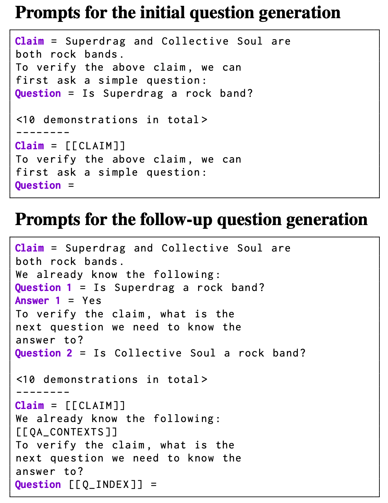
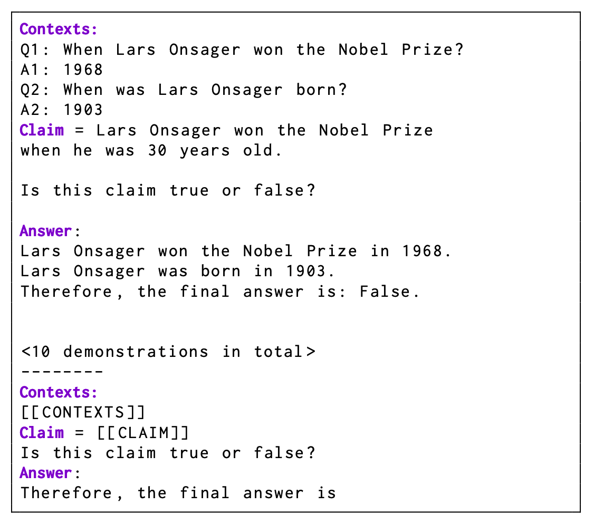

# To run 
1. prepare checkpoint
```
mkdir checkpoint
wget -O checkpoint/model_base_retrieval_coco.pth https://storage.googleapis.com/sfr-vision-language-research/BLIP/models/model_base_retrieval_coco.pth
```
2. run
```
python src/run.py
```


# QACHECK
[QACHECK: A Demonstration System for Question-Guided Multi-Hop Fact-Checking](https://arxiv.org/abs/2310.07609)

the Question-guided Multi- hop Fact-Checking (QACHECK) system：guides the model’s reasoning process by ask- ing a series of questions critical for verifying a claim

five key modules
- a claim verifier $\mathcal D$ ：assesses whether sufficient information has been gathered to verify the claim
- a question generator $\mathcal Q$ ：generate the next relevant question
- a question-answering module $\mathcal A$ ：answer the raised question
- a QA validator $\mathcal V$ ：evaluate the usefulness of the generated (Q, A) pair
- a reasoner $\mathcal R$ ：output the final veracity label based on all collected contexts



首先初始化一个空白的上下文字典 $\mathcal C=\empty$ 。
- $\mathcal{D}(c, \mathcal{C}) \rightarrow\{$ True, False $\}$ ：依次遍历每一个 claim ，使用 claim verifier 判断当前的 claim 是否被上文支持。
    - 根据 in-context learning（ten distinct in-context examples）
    

- $\mathcal{Q}(c, \mathcal{C}) \rightarrow q$ ：如果答案为 Flase，则 question generator 生成下一个问题。
    - different prompts for generating the initial question and the follow-up questions
    

- $\mathcal{A}(q) \rightarrow a, e$ ：question-answering module 根据问题检索对应的事实依据 $e$ ，并且得到答案 $a$ 。
这里尝试三种方法：
    1. Retriever–Reader ：Retriever 负责检索（Wikipedia，BM25），Reader 回复答案（fine-tuned RoBERTa-large）。
    2. FLAN-T5 ：仅仅根据 FLAN-T5 的内部参数生成事实和答案
    3. GPT Reciter–Reader ：让 Instruct-GPT 生成事实，使用另一个模型得到答案。不依赖外部数据。

- $\mathcal{V}(c,\{q, a\}, \mathcal{C}) \rightarrow\{$ True, False $\}$ ：根据 context 和当前的 claim 判断 $(q,a)$ 是否能支撑 claim 的合理性。
    - 判断和理性后，直接将 $(q,a)$ 加入到 context 中
    - 如果结果为 False，则重新调用 $\mathcal{D}, \mathcal{Q}, \mathcal{A}, \mathcal{V}$ 来得到其他问题并且回复 。
    - prompt：
        ```
        Claim = CLAIM
        We already know the following:
        CONTEXT
        Now we further know:
        NEW QA PAIR
        Does the QA pair have additional knowledge useful for verifying the claim?
        ```

- $\mathcal{R}(c, \mathcal{C}) \rightarrow\{$ Supported, Refuted $\}$ ：最终模型根据 context 生成最终的标签 。
    - 两种方法：1) the end-to-end QA model based on FLAN-T5 或 2) the InstructGPT model with the prompts
    


# ClaimNorm
[https://arxiv.org/abs/2310.14338](https://arxiv.org/abs/2310.14338)